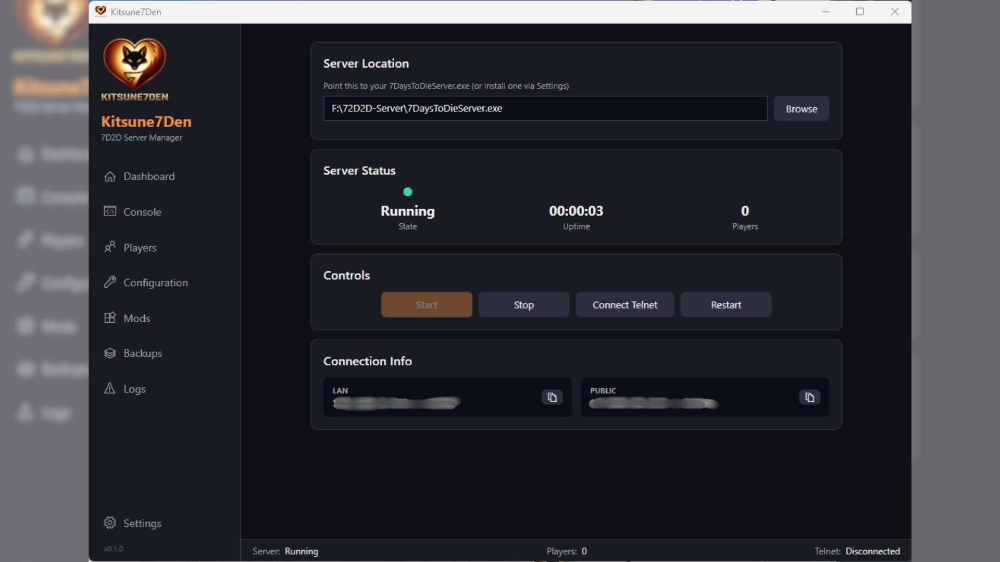
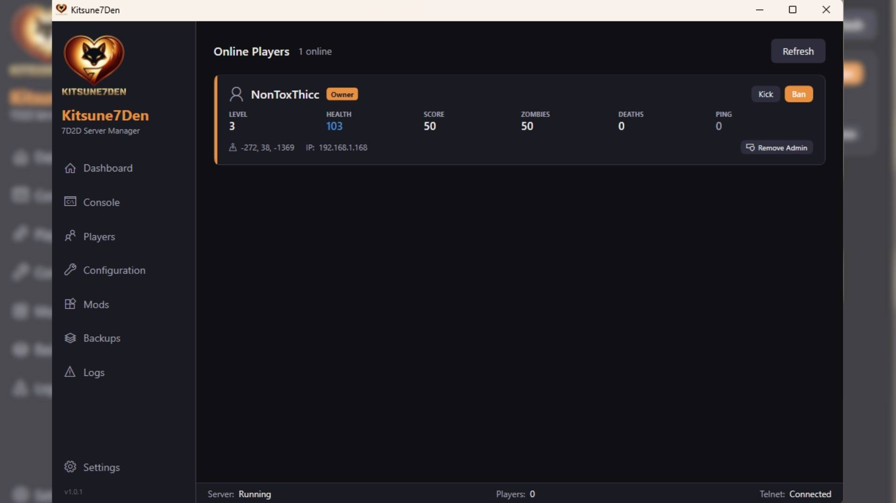
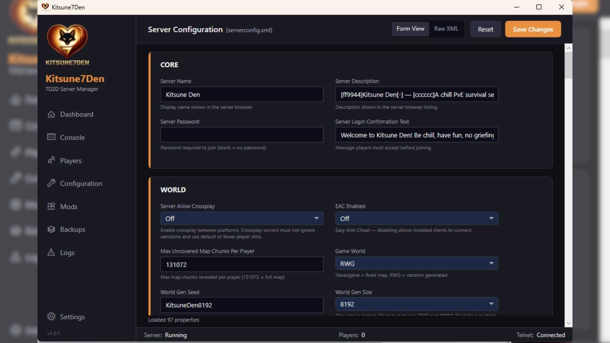
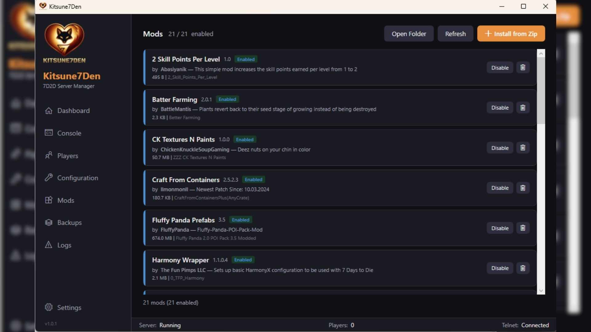
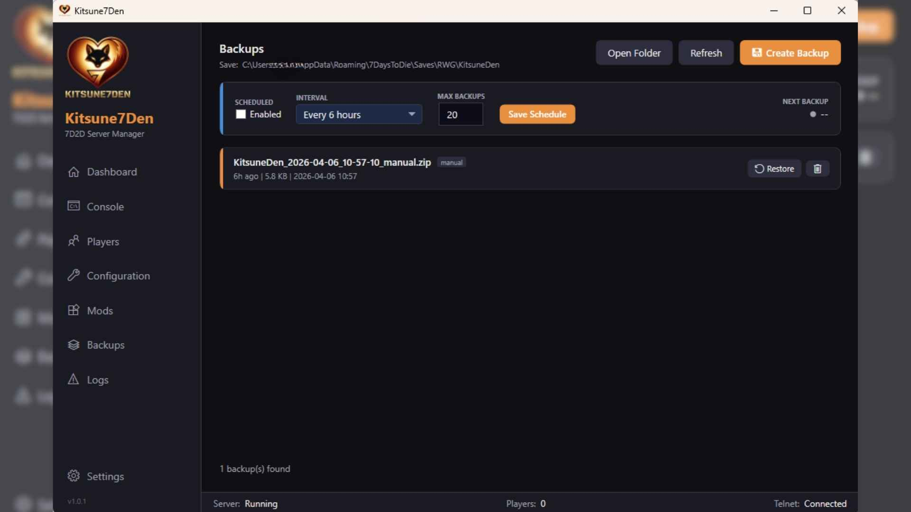

<p align="center">
  
</p>

<h1 align="center">Kitsune7Den</h1>
<p align="center"><strong>7 Days to Die Server Manager</strong></p>
<p align="center">A standalone Windows desktop app for managing your 7D2D dedicated server.<br/>No web stack. No browser. Just a simple exe.</p>

---

## Features

- **Dashboard** -- Start/stop/restart server, connect telnet, view LAN/public IPs with click-to-copy
- **Console** -- Live server log tailing + telnet command input with history
- **Players** -- Player cards with stats, admin badges, kick/ban, give/remove admin via serveradmin.xml
- **Configuration** -- Grouped form editor with 90+ properties, smart dropdowns, Raw XML toggle
- **Mods** -- List installed mods, enable/disable, delete, install from zip
- **Backups** -- Manual + scheduled backups, restore with automatic safety backup, auto-prune
- **Logs** -- Browse all server log files with dropdown selector and text filter
- **Settings** -- SteamCMD install/update, auto-update on start, telnet config
- **Themes** -- 4 live-swappable themes (Kitsune, Midnight, Forest, Accessible/colorblind-friendly)
- **Config Protection** -- Automatically backs up serverconfig.xml before Steam updates, restores after

## Screenshots

### Dashboard
Start/stop/restart the server, view uptime, and copy LAN/public addresses in one click.



### Players
Live player cards with stats, admin badges, and one-click kick/ban/admin toggle — reads and writes `serveradmin.xml` directly.



### Configuration
Grouped form editor for every property in `serverconfig.xml`. Smart dropdowns, auto-discovered world list, day/night calculator, raw XML toggle.



### Mods
Card-based mod browser reading `ModInfo.xml`. Enable, disable, delete, or install directly from a zip.



### Backups
Manual or scheduled backups of your save. Restore with an automatic safety backup. Auto-prunes old backups.



## Quick Start

1. Download `Kitsune7Den.exe` from [Releases](https://github.com/Kitsune-Den/Kitsune7Den/releases)
2. Run it
3. Browse to your `7DaysToDieServer.exe`
4. Hit Start

## Building from Source

Requires [.NET 8 SDK](https://dotnet.microsoft.com/download/dotnet/8.0).

```bash
dotnet build
dotnet run --project src/Kitsune7Den
```

To publish a single-file exe:

```bash
dotnet publish src/Kitsune7Den -c Release -r win-x64 --self-contained -p:PublishSingleFile=true -o ./publish
```

## Tech Stack

- .NET 8 / WPF / MVVM (CommunityToolkit.Mvvm)
- Telnet client for server commands + player data
- XDocument for serverconfig.xml + ModInfo.xml + serveradmin.xml parsing
- SteamCMD integration for server install/update

## License

MIT
